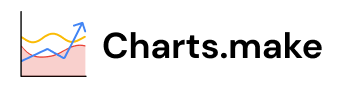

# Charts.make - A data visualization project

Welcome to our data visualization web app, where the power of your data meets the creativity of your vision. With our intuitive platform, you're in control from start to finish. Simply input your data into our flexible table interface, and watch as it transforms into dynamic visualizations tailored to your preferences. Whether you're charting trends, analyzing patterns, or telling a compelling story, our tool puts the tools of insight at your fingertips. Choose from a variety of chart types to bring your data to life, from sleek line graphs to vibrant pie charts. The possibilities are endless, and the insights are yours to discover. Say goodbye to static spreadsheets and hello to a new era of interactive exploration. Get ready to uncover the potential within your data, and embark on a journey of discovery like never before.

## Development

Google Charts API: https://developers.google.com/chart

## The App

